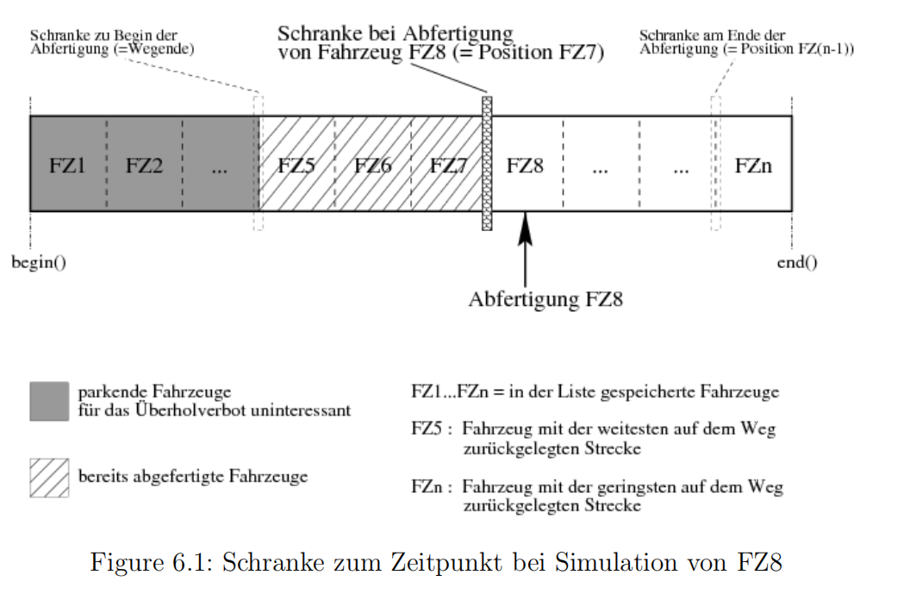
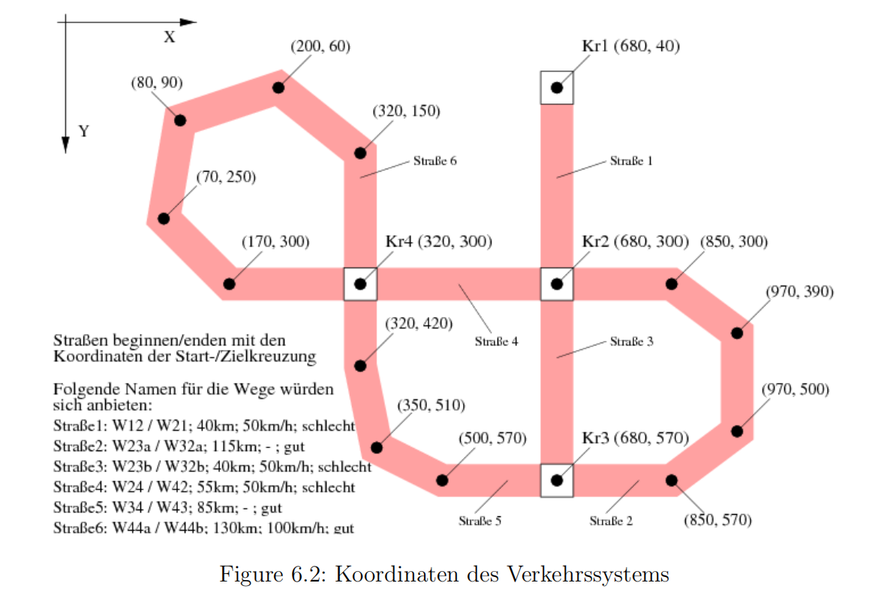

# 6 任务模块 3: 交通系统模拟
## 6.1 动机
在该模块的第一部分中，将实现一个简单的算法问题：车辆不应在禁止超车的道路上超车。目前只能生成单独的、不连续的道路，并且车辆只能在一条道路上行驶。在最后一个任务模块中，这些将被整合为一个完整的交通网络。
为了将道路连接成一个交通网络，引入了交叉路口。车辆将开始时停放或行驶在交叉路口。当到达道路尽头时，车辆应切换到该交叉路口的另一条道路并继续行驶。为了避免在需要修改交通系统或增加更多车辆时，必须重新编译和生成整个项目，最后一步将通过描述文件中的ASCII文件生成交通网络。
在这个任务模块中将探讨以下几个方面：

- 非平凡的修改和扩展已有项目，
- 实现一个简单的算法，
- STL（映射），
- 从文件中读取数据并生成数据结构。
为了获得概览，请先通读第三个任务模块。

## 6.2 超车禁令

后续的任务可以归纳为方法编程。这意味着本章中的算法并不像之前的任务那样具体描述。

1. 创建一个名为“任务模块3”的新项目。拷贝所有源文件（仅包括 *.h 和 *.cpp 文件以及 SimuServer.jar 文件）从任务模块2到新项目，并使这些文件被新项目识别。

2. c

3. 再次测试异常类的处理方法：到达道路尽头的车辆应输出并从列表中删除。当一个停放的车辆到达起始时间时，应开始行驶（列表中的位置将发生变化），并输出它的名字、起始时间和起始点（道路）。在时间过半时，另有一辆停放的车辆应被接受加入路径。您的模拟应持续运行，直到所有车辆都开始行驶并到达路径的终点。输出应实现为能够识别出车辆在列表中的重新排序。

4. 由于在我们的交通系统中，一些不完善的道路上超车非常危险，请在 `Fahren::dStrecke()` 中实现一个超车禁令。此外，自行车也不能被超车。为了简化，可以允许并排行驶（相同位置）。超车禁令应通过一个新的布尔成员变量 `Weg::bUeberholverbot` 来控制（true = 不完善的道路，带有超车禁令）。请在 `Weg` 的构造函数中添加一个表示超车禁令的参数。如果未指定该参数，则默认认为这条道路是不完善的。另一个条件是，抛锚的汽车（即油箱空了的汽车）不应对后续车辆构成障碍。

   **提示：**除了定义道路长度外，还引入一个虚拟障碍，该障碍始终设置在当前模拟运行到的车辆位置上。后续车辆不能超过这个障碍的位置。编写一个 getter 函数来获取虚拟障碍位置，并考虑这条道路是否有超车禁令。然后在计算剩余距离时，用此函数的调用替换对道路长度的查询。
   要清楚的是，由于列表的特殊结构（见图 6.1），可以实现超车禁令。当然，也允许其他解决方案。

   

5. 测试超车禁令需要通过重新调用函数 `vAufgabe6()` 来实现。

## 6.3 交通系统的构建

1. 目前，交通网络仅由独立的路段及其上的车辆组成。现在，这些路段应通过十字路口连接起来。由于基础设施完善，不应存在单行道，每条道路应由去程和返程组成。

   扩展类层次结构，添加从 `Simulationsobjekt` 派生的类 `Kreuzung`。  
   类 `Kreuzung` 通过一个列表 `ppWege` 存储从该十字路口发出的所有道路，并包含一个成员变量 `pdTankstelle`。该变量存储十字路口用于加油的可用油量。  

   当一辆小汽车（PKW）经过带有加油站（`pdTankstelle > 0.0`）的十字路口时，将会被加满油，同时减少 `pdTankstelle` 中相应的油量，直到加油站的油用完。为简化处理，系统提供了一个储备量，确保最后一辆车也能加满油。

   编写一个静态方法 `Kreuzung::vVerbinde(...)`，其参数包括：去程和返程的名称、路段长度、起点和终点的十字路口、有效的速度限制以及可能的超车禁令。  

   此函数必须是静态的，并且需要以参数的形式传递两个十字路口。为了能够连接这些十字路口，需要创建路段并使它们相互关联，也就是说，一个路段需要知道其对应的返程路段，以及它通向哪个十字路口。  

   对于 `ppWege` 中的元素，您可以选择使用哪种类型的智能指针？

   由于路段和十字路口可能存在循环引用，用于存储目标十字路口和返程路段的变量应使用 `weak_ptr` 类型。  
   请为类 `Weg` 添加相应的成员变量。目标十字路口可以设为 `const`，因为它不会发生改变。因此，您需要相应调整 `Weg` 的构造函数，并将目标十字路口初始化为 `nullptr`。  

   为什么返程路段的变量不能设置为 `const`？  
   请为这两个变量编写 Getter 方法，这些方法应返回指向目标对象的 `shared_ptr`。需要注意的重要一点是，您在实现时需要使用 `lock`。

   此外，应在 `Kreuzung` 类中实现函数 `vTanken(Fahrzeug&)`，该函数可以根据需要为传入的车辆加满油，并更新加油站的油量。  

   实现方法 `Kreuzung::vAnnahme(unique_ptr<Fahrzeug>, double)`，用于接收车辆并将其停放在第一个发出的路段上。在此过程中，车辆应根据需要加满油。  

   最后，实现函数 `Kreuzung::vSimulieren()`，以仿真从该十字路口发出的所有路段的运行情况。

2. 在转移车辆时，应从十字路口发出的路段中随机选择一个。但车辆不应返回其来时的路段。为此，实现一个函数 `shared_ptr<Weg> Kreuzung::pZufaelligerWeg(Weg&)`，它的参数是表示车辆进入十字路口的路段的引用，返回值是为车辆选择的路段。如果是“死胡同”，则必须选择返程路段。

   将此功能集成到路段终点的处理函数中，使到达路段末尾的车辆可以被设置为行驶状态，并转移到所选的路段上。在此过程中，车辆也应被加满油。

   为了更好地追踪车辆的移动，转移时应输出以下信息：
   - **时间**：`[转移的时间点]`  
   - **十字路口**：`[十字路口名称]` `[加油站的剩余油量]`  
   - **更换**：`[旧路段名称] → [新路段名称]`  
   - **车辆**：`[车辆信息]`  

3. 在 `vAufgabe 7()` 中测试目前的 `Kreuzung` 类，通过构建一个如图 6.2 所示的交通网络，并在其中通过十字路口 `Kr1` 接收车辆。  

   为了图形化展示十字路口，可以使用以下方法：  
   ```cpp
   void bZeichneKreuzung(int posX, int posY);
   ```
   此函数会在坐标 `(posX, posY)` 处绘制一个十字路口。

   接着，将十字路口 `Kr2` 的油箱容量设置为 1000 升，并模拟这些十字路口的运行。其他十字路口不设加油站（油箱容量 = 0）。



## 6.4 作为文件的交通系统（文件流，map）

1. 为仿真对象重载输入运算符 `operator >>()`。类似于输出运算符 `operator <<()` 的解决方案，首先实现一个方法 `vEinlesen(istream&)`。各个类应按如下方式读取数据：

   - **Simulationsobjekt**: `[Name]`
   - **Kreuzung**: `[Simulationsobjekt] [加油站容量（升）]`
   - **Fahrzeug**: `[Simulationsobjekt] [最大速度（公里/小时）]`
   - **PKW**: `[Fahrzeug] [油耗（升/100公里）] [油箱容量（升）]`
   - **Fahrrad**: `[Fahrzeug]`

   实现 `Simulationsobjekt::vEinlesen` 时，确保只有在尚未识别的对象（`psName = ""`）中才能读取数据。如果读取过程中出现错误，抛出一个运行时错误（`runtime error`）并给出错误信息。此异常应在主程序中捕获并输出。

   为了测试新的运算符，请使用包含一辆小汽车、一辆自行车和一个十字路口的文件 `VO.dat`。将该文件复制到项目目录中。在 `vAufgabe 8()` 中，将 `VO.dat` 作为 `ifstream` 打开。按照脚本中描述的方式启用流的异常处理。如果在打开或输出时抛出异常，请输出异常信息并中止程序。创建三个相应的对象（自行车、小汽车和十字路口），从文件中读取它们，并在屏幕上显示它们。

   

2. 为了能够方便地进行不同的仿真，实现一个 `Simulation` 类，该类提供两个方法：`vEinlesen(istream&)` 和 `vSimulieren()`。`vEinlesen` 方法接收一个输入流，并从中生成完整的交通网络。输入流的内容由以下语法的行组成：

   - `KREUZUNG <十字路口数据>`
   - `STRASSE <NameQ> <NameZ> <NameW1> <NameW2> <长度> <速度限制> <超车禁令>`
   - `PKW <小汽车数据> <NameS> <出发时间>`
   - `FAHRRAD <自行车数据> <NameS> <出发时间>`

   

   以下是一些值的约定：  

   - **NameQ**: 源十字路口的名称  
   - **NameZ**: 目标十字路口的名称  
   - **NameW1**: 从源十字路口到目标十字路口的路段名称  
   - **NameW2**: 从目标十字路口到源十字路口的路段名称  
   - **Tempolimit**:  
     - `enum`: 1（市区） 2（乡村公路） 3（高速公路）  
   - **Überholverbot**:  
     - `bool`: 0（错误）或 1（正确）  
   - **NameS**: 起始十字路口的名称  

   对于输入流的每一行，执行相应的操作。为此，创建一个与关键字（`KREUZUNG`、`PKW`、`FAHRRAD`）相对应的空对象，并读取该对象的预定数据，或者连接两个十字路口（`STRASSE`）。统计行数，以便在发生错误时能够输出行号。如果遇到未知的关键字，抛出一个运行时错误（`runtime error`）。在循环之外捕获错误，输出行号和错误信息，并将错误传递下去。读取对象特定数据时，应使用重载的输入运算符。

3. 由于模拟对象在某些情况下会自动生成，因此在一些情况下只有名称（`string`）是已知的。为了构建整个交通系统，需要能够通过名称查找对模拟对象的引用。为此，在 `Simulation` 中创建一个 `map`，将名称映射到相应的十字路口。如果在读取模拟时创建了一个十字路口，则将其通过名称插入到 `map` 中。如果在 `map` 中已经存在该名称的对象，则抛出一个 `std::runtime_error`，并提供相应的错误信息。以后，当需要访问某个十字路口时，使用 `map` 来查找。如果在给定的名称下没有找到对象，则抛出异常。

   测试您的 `map` 并检查是否能捕获所有的错误输入。

4. 实现一个方法 `Simulation::vSimulieren(double dDauer, double dZeitschritt)`，该方法用于在给定的持续时间和相应的时间步长下，模拟所有在模拟中已知的十字路口。

5. 实现 `vAufgabe 9` 方法，该方法打开一个输入文件并从该输入流中生成模拟。使用输入文件 `Simu.dat`。该文件包含错误。测试程序是否能识别所有错误并抛出相应的异常，并且逐一修正 `Simu.dat` 中的错误。请事先创建该文件的副本。程序应能够检测到所有错误。只需找到一个错误并在文件中进行修正，然后在下次运行程序时检测到下一个错误即可。在错误被程序识别之前，不要进行任何修正。这是检查错误输出的行号是否正确的好机会。

6. 作为最后一项任务，我们将模拟与图形表示结合起来。为 `vEinlesen` 函数添加一个 `bool bMitGrafik` 参数，默认为 `false`。如果在函数中设置了该参数，则语法和行为应进行扩展。对于每个关键字，应该读取以下附加值：

   - 对于 `KREUZUNG` 行，添加交叉口位置的两个坐标。
   - 对于 `STRASSE` 行，读取坐标对的数量，然后为每个坐标对读取 X 和 Y 坐标。

   在 `vAufgabe 9a` 中实现一个带图形的模拟，并使用 `SimuDisplay.dat` 作为模拟的输入文件。