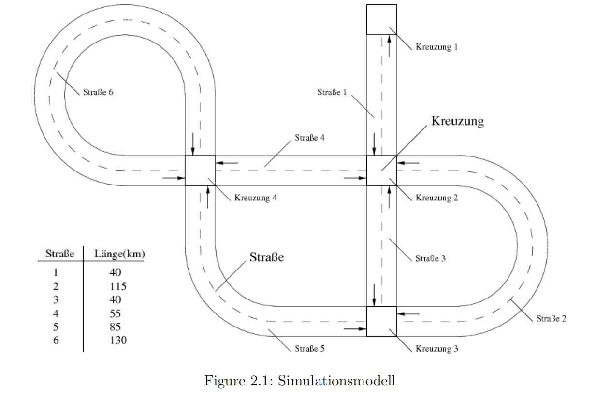

# 2 目标任务

需要对一个欠发达地区的道路交通进行建模和仿真（参见 2.1）。  

不同类型的车辆（如小汽车、自行车）将在各自的启动时间从某个节点（十字路口）出发。每辆车都有一个时间计数器和一个距离计数器，分别记录总行驶距离和当前路段的行驶距离。路网和车辆的数据通过构造函数设置或读取。  

该模型由三种不同的仿真对象组成：车辆、道路和十字路口。两座十字路口之间的连接通过一条道路实现，而这条道路由两个相反方向的路段（去程和返程）组成。每个路段管理在该路段上的车辆，而每个十字路口管理从该十字路口出发的所有路段。路段既可以容纳行驶中的车辆，也可以容纳停放的车辆。当仿真达到停放车辆的启动时间时，该车辆将从停放状态切换为行驶状态。

所有仿真对象都包含一个执行仿真步骤的函数。十字路口负责仿真从它们发出的路段，而路段负责仿真其上的车辆。因此，在每个时间步中，通过系统中所有十字路口的仿真，会依次处理所有仿真对象。  

系统由一个全局时间步调控制。在每个时间步中，系统中的每个对象都会被模拟一次。这是通过比较每个仿真对象的最后仿真时间与全局时间，并随后进行同步实现的。在仿真系统的一些路段上，有时会禁止超车，即在一个仿真步骤中，车辆不得超过其前方车辆的位置。此外，由于路段的类型（如城市道路、乡村公路、高速公路），可能会有速度限制。  

图 2.2 展示了仿真的主要类结构，图 2.3 则提供了辅助类的概览。尽管可能存在其他结构和实现方式，但在实习中我们以此结构为基础。并未列出所有函数（如构造函数/析构函数），部分函数仅在层级最高的类中展示，但这些函数可以在派生类中被重写。

# 3 实施说明

以下提供了一些关于如何进行实习的提示。应尽可能遵循这些提示，以便减轻导师的工作负担并减少可能的错误来源。实习的任务将在开发环境 Eclipse 中处理。您会发现，Eclipse 提供了许多 C++ 编程的功能。在本实习过程中，仅涉及 Eclipse 的一小部分功能。当然，您可以自由地更深入地探索 Eclipse 并使用更高级的功能。

## 3.1 交通模拟的管理

任务分为三个任务块。每个任务块将作为项目 "Aufgabenblock_X"（X=1,2,3）创建，并保存在所选的 Eclipse 工作空间中。然后在相应的 main() 函数中为每个任务调用相应的函数 vAufgabe_X()，以测试与该任务相对应的功能。

## 3.2 项目管理

### 3.2.1 创建新项目

由于过去总是出现问题，因此在此提供了详细的指导。

1. 打开 “File → New → Project”。

2. 在打开的窗口中，选择 "C/C++ → C/C++ Project"，然后确认并点击 Next。

3. 在新窗口中选择 "All → C++ → Managed Build"，然后再次点击 Next。

4. 现在，在 "Project name" 下输入相应的项目名称（例如 "Aufgabenblock1"），并选择 "Project type → Executable → Empty Project"。在右侧，选择 "Toolchain" 为 "MinGW GCC"。默认设置保持不变。最后点击 Finish（参见图 3.1）。

以下是第二张图片内容的翻译：

---

图 3.1: 创建新项目

### 3.2.2 生成 C++ 文件

1. 在 Project Explorer 中选择相应的项目。右键点击该项目，在弹出的上下文菜单中选择 New。现在，您可以从以下选项中选择：

   a) **Header File**：您可以创建一个空的 `.h` 文件。在此过程中，您需要输入文件名（例如与类名相关的名称，如 `Fahrzeug.h`），并选择一个模板。作为模板，请选择默认的 C++ 头文件模板。

   b) **Source File**：通过此选项，您可以创建一个空的 C++ 源文件。文件名例如可以是 `Fahrzeug.cpp`。作为模板，请选择默认的 C++ 源文件模板。

   c) **Class**：通过此菜单项，您可以创建一个包含头文件和源文件的整个类。在创建过程中，您需要指定一个源文件（例如 `Aufgabenblock_1` 项目），定义类名（如 `Fahrzeug`），并通过 "Method stubs" 选项让系统自动生成一些基础的构造函数和析构函数。

2. 生成的文件将显示在您的项目目录中，您可以相应地填充文件内容和功能。

---

### 3.2.3 将内容导入新项目

1. 首先按照创建新项目的前三个步骤操作。

2. 作为名称，选择 "Aufgabenblock_2" 或 "Aufgabenblock_3"。

3. 然后确认，您的工作区中会创建一个新的子目录 "Aufgabenblock_X"。

4. 将旧项目中的源文件复制到新项目的目录中（重要：只复制 `.h` 和 `.cpp` 文件！）。如果有，您还可以复制 Moodle 上提供的模板文件。

5. 在 Eclipse 中，您需要将新文件加载到新项目中。为此，在 Project Explorer 中选择刚刚创建的项目，并按 F5 键刷新。这样，Eclipse 就会加载新文件，并显示在项目中。

**提示**：要执行项目，请在 Project Explorer 中选择项目，然后选择 "Project → Build Project"。这样，您的项目就会被编译。接下来，您可以通过 "Run → Run as → 2 Local C/C++ Application" 来运行该项目。

---

### 3.3 命名约定

在您的所有解决方案中，请使用以下前缀为变量和函数命名。这不仅有助于您（以及我们）阅读源代码，而且从名称中可以看出变量或函数的类型。

- 类的实例变量在变量名前加一个前缀 "p-" 进行标识。

- 紧接其后的是一个字母，描述变量或函数返回值的类型：
  - i=int; t=struct; d=double; v=void; b=bool; s=string; p=pointer; e=enum;

- 接下来是变量的实际名称，第一个字母和每个单词的首字母都应大写。

- 特殊情况下，如果函数仅设置或返回一个私有或受保护的变量，变量名前加上 "get" 或 "set"，然后是变量名称及其前缀。这样的函数称为 getter/setter 方法。

- 一个函数通过其名称后面加上圆括号来标识。

---

**示例**：

- `p_iID`: 受保护的/私有的 `int` 类型变量。
- `bIstFertig()`: 返回布尔值（`true` 或 `false`）的函数。
- `getID()`: 变量（`p_iID`）的 getter。
- `vFunktion()`: 不返回任何值（`void`）的函数。

### 3.4 编程提示

- 为每个类实现一个文件 `Klassenname.h` 来声明变量和函数。每个类还应有一个 `Klassenname.cpp` 文件，用于定义代码。

- 除了解决任务所需的函数外，您当然还可以实现自己的函数。

- 为您的程序编写足够的注释，以便外部人员（例如，评审人员）可以理解您的代码。这一点也会作为评分的依据。

- 在定义函数、变量或参数时，决定是否应将它们声明为 `const`。尽可能在合适的情况下使用 `const`。

- 如果您使用了 STL 的多个元素，可以在相应的 include 文件之后使用 `using namespace std;`。但请注意，这不应该是常规做法。

- 实习期间提供给您的所有文件都可以在 RWTH Moodle 的课程板块下找到，位于“模板文件”部分。

- 请注意任务的程序结构应保持层次化。

- 尽可能在各种情况下测试您创建的类和函数。单一测试并不能证明程序的正确性。因此，请选择多个具有代表性的测试用例，并说明您的测试方法。这个点也会纳入评分（例如，忽略的测试用例或仅通过自动化工具测试会导致扣分）。

---

